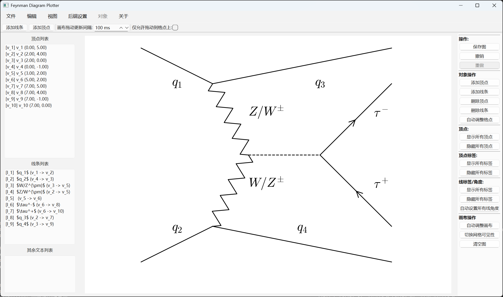

# Matplot-Feynman-Diagram

A Python package for drawing Feynman diagrams with Matplotlib.

# Welcome! Please choose your language:
- [English](README.md)
- [简体中文](README.zh.md)

## Features

- Customizable arrows, vertices, and loop diagrams
- LaTeX-like concise syntax
- SCI paper publication-level high-quality graphics

## Requirements

Python $\ge$ 3.10

requirements.txt

## Usage

### Launch from terminal (conda environment supported，multi-os way )

1. Prepare a Python environment $\ge3.10$

2.  pip install requirements.txt
3. Then run `python starUI/launcher.py`

### Launch via executable (Windows and Ubuntu supported)

#### Windows

Ensure Python $\ge3.10$ is in the system environment variables.

Double-click `launcher.exe` in the root directory. It will automatically detect the environment; if not installed, it will ask for installation. After installation, it will start automatically.

#### Ubuntu

Ensure Python $\ge3.10$ is in the system environment variables.

In the root directory, run `./launcher`. It will automatically detect the environment; if not installed, it will ask for installation. After installation, it will start automatically.

## Examples

