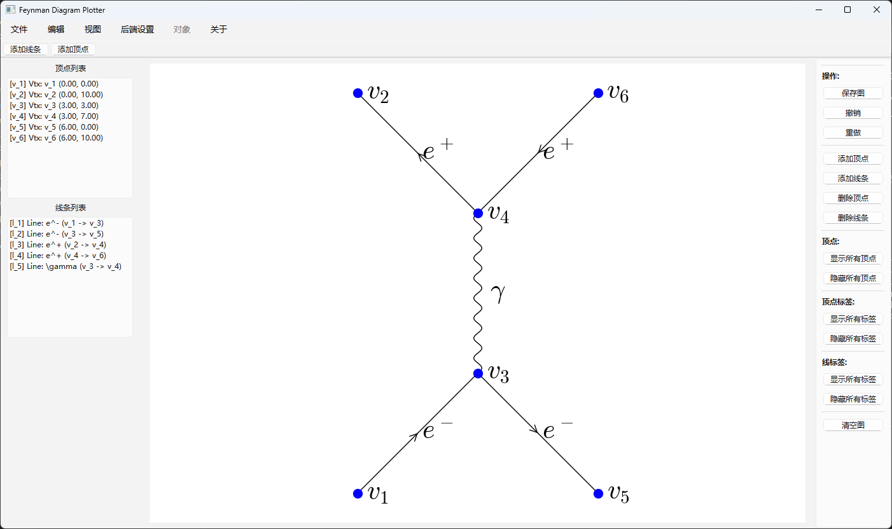

# Matplot-Feynman-Diagram

一个基于 Matplotlib 绘制费曼图的 Python 包。

## 特性

- 可自定义箭头、顶点和圈图
- 类似 LaTeX 的简洁语法
- SCI Paper发表级别的高质量图形

## 使用方法

打开一个终端(terminal)，进入根目录(也就是这个 README 文件所在的目录)，输入以下命令：
``` bash    
pip install -e .
```
然后确认是否安装成功，如果安装成功，会显示以下信息：
``` bash
    <......>
    <其余消息>
Successfully installed pyfeynplot-0.1.0
```
然后输入以下命令：
``` bash
feynplot-gui
```
即可显示GUI界面，如下图所示：

